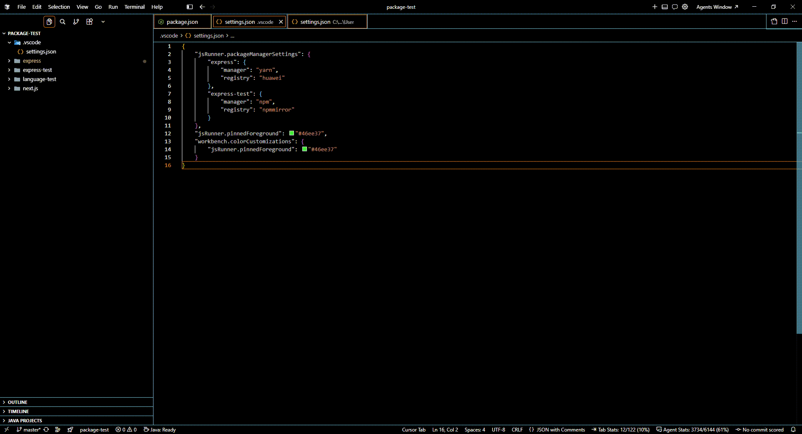
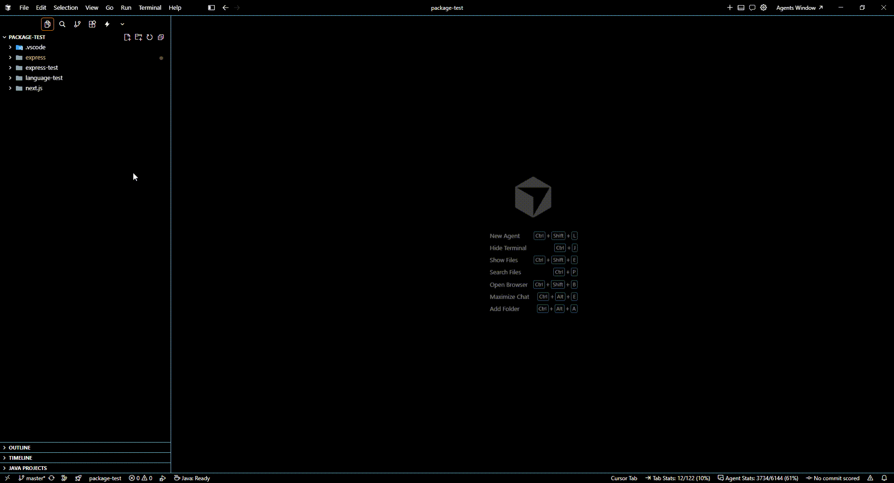

# JS Runner Kit





**English** | [中文](#中文)

Repository: [https://github.com/li1125435097/js-runner](https://github.com/li1125435097/js-runner)


A VS Code / Cursor extension for running source files and npm scripts in parallel terminals, with sidebar views for npm scripts, package management, active runs, and configurable language interpreters.

## Features

- **Run current file** — Editor title bar play button and F4 when the file's language has a configured interpreter
- **Parallel terminals** — Each run opens its own terminal; Ctrl+F4 runs the same file in a new terminal without stopping others
- **NPM Scripts sidebar** — Scans all `package.json` files (excluding `node_modules`), groups scripts by package, and auto-refreshes when `package.json` or lockfiles change
- **Search packages** — Filter the NPM Scripts tree by package path (toolbar search, or the search row at the top of the view)
- **Pin packages and scripts** — Pin frequently used packages or scripts to the top; pinned rows use a customizable highlight color
- **Package manager** — Per-package manager (`auto` / npm / yarn / pnpm / bun / custom) and registry (official, mirrors, or a custom URL)
- **Install dependencies** — One-click install in a dedicated terminal; optionally wipe existing `node_modules` first
- **View installed packages** — Webview table of declared vs installed versions; switch among locally cached versions from a dropdown, or add another version from the registry without changing `package.json`
- **Debug NPM scripts** — Inline debug button on Node/JS-related scripts (vite, tsx, node, etc.); launches the VS Code JavaScript Debugger with breakpoints when possible
- **Script shortcuts** — Keyboard icon on each npm script; pick an unused F-key or recommended combination, or enter a custom keybinding with conflict detection
- **Running Scripts sidebar** — Lists active terminals; click to focus or stop individual runs
- **Language Interpreters sidebar** — Lists supported languages and interpreter paths; add, edit, or remove entries
- **MCP Server** — Local HTTP MCP endpoint that exposes every JS Runner command to external clients, with a sidebar config panel and call logs

## Installation

Install from a packaged `.vsix`:

```bash
npm run package
npm run install:plugin
```

Or install manually in VS Code / Cursor: **Extensions** → **⋯** → **Install from VSIX…** → select `js-runner-kit-0.0.5.vsix` (also available under `release/`).

## Sidebar views

Open the **JS Runner** activity bar icon to access:

| View | Description |
|------|-------------|
| **NPM Scripts** | Workspace npm scripts grouped by `package.json`; search, pin, run, debug, bind shortcuts, and manage packages |
| **Running Scripts** | Terminals currently tracked by the extension; click a row to focus its terminal |
| **Language Interpreters** | Language → interpreter mapping used when running files |
| **MCP Server** | Enable/disable the local MCP HTTP server, set port and API key, and open call logs |

Each package group contains scripts plus a **Package Manager** section:

| Row | Description |
|-----|-------------|
| **Manager** | CLI used to run scripts and install (`auto` shows the detected manager) |
| **Registry** | Registry used for install (`auto` reads `.npmrc`, otherwise a preset or custom URL) |
| **Install Dependencies** | Run `{manager} install` in a new terminal |
| **View Installed Packages** | Open a webview of declared vs installed dependencies, with local version switching |

## MCP Server

The extension starts a local [Model Context Protocol](https://modelcontextprotocol.io/) HTTP server on `127.0.0.1` so Cursor, VS Code, or other MCP clients can call the same commands as the sidebar.

Configure it in the **MCP Server** sidebar view:

- **Enable** — On by default. Turning it off stops the server immediately
- **Port** — Default `38888`. Changing the port restarts the server from that preferred port. If the port is in use, the server tries `port + 1` until `65535`. If none are free, status is `stop`
- **API Key** — Empty by default (no auth). Generate a random 32-character key, or type your own. When set, clients must send `api-key`, `X-Api-Key`, or `Authorization: Bearer <key>`
- **Call log limit** — Default 100,000 entries; older records are dropped. **View call logs** opens the table in the editor. Logs are in-memory and clear when the extension reloads
- **MCP config** — Live JSON with the current port and API key, plus a **Copy** button

An API key is recommended. The server is bound to localhost only, but any local process can call it when the key is empty.

Example client config (same as the sidebar copy output):

```json
{
    "js_runner_kit": {
        "url": "http://127.0.0.1:38888/mcp",
        "headers": {
            "api-key": "YOUR_API_KEY"
        }
    }
}
```

Omit `headers` when the API key is empty. If the preferred port was busy, use the endpoint shown in the sidebar (the actual bound port). Tools are named like `jsRunner_runNpmScript`; `jsRunner_listNpmScripts` and `jsRunner_listRunningScripts` help discover paths and terminal ids.

## Commands

| Command | Shortcut | Description |
|---------|----------|-------------|
| Run JS File | F4 | Run current file (replaces existing terminal for the same file) |
| Run JS File in New Terminal | Ctrl+F4 | Run current file in a new terminal |
| Stop All Running Scripts | — | Close all tracked terminals |
| Stop Running Script | — | Close one terminal from Running Scripts |
| Focus Running Terminal | — | Focus a terminal from Running Scripts (also triggered by clicking a row) |
| Search Package Path | — | Filter NPM Scripts by `package.json` path |
| Clear Search | — | Clear the package path filter |
| Pin / Unpin | — | Pin a package or script to the top of the list |
| Refresh NPM Scripts | — | Rescan workspace for `package.json` scripts |
| Run NPM Script | — | Run a script from the NPM Scripts sidebar |
| Debug NPM Script | — | Debug a JS-related script from the NPM Scripts sidebar |
| Set Script Shortcut | — | Bind a key to run an npm script from the sidebar |
| Run NPM Script (Shortcut) | assigned key | Run the npm script bound to that shortcut |
| Select Package Manager | — | Choose the CLI used to run/install for a package |
| Select Registry | — | Choose the npm registry for install |
| Install Dependencies | — | Install dependencies for a package |
| View Installed Packages | — | Open declared vs installed packages and switch cached versions |
| Add Language Interpreter | — | Add a language + interpreter in the sidebar (+ button) |
| Edit Language Interpreter | — | Edit label or path for an existing entry |
| Remove Language Interpreter | — | Remove an interpreter entry |

Shortcuts appear only when the current editor language has a matching interpreter (`jsRunner.canRunCurrentFile`). Per-script shortcuts work globally once assigned.

## Search and pin

### Search packages

Use the **search** icon in the NPM Scripts toolbar, or click the search row at the top of the tree. The filter matches:

- Absolute `package.json` path
- Tree label (for example `my-app/packages/core`)
- Relative package key (for example `packages/core`)

Matching packages stay expanded while a filter is active. A **Clear Search** button appears in the toolbar until the filter is cleared.

### Pin packages and scripts

Click the **pin** icon on a package group or script. Pinned items:

- Move to the top of their list (packages among packages, scripts among scripts)
- Keep pin order (most recently pinned first)
- Use the highlight color from `jsRunner.pinnedForeground` (default `#46ee37`)
- Persist in workspace state across reloads

Unpin with the filled pin icon. Change the color in user or workspace settings:

```json
{
  "jsRunner.pinnedForeground": "#46ee37"
}
```

You can also override the theme color `jsRunner.pinnedForeground` via `workbench.colorCustomizations`.

### Script shortcuts

Click the **keyboard** icon on a script row (after Run / Debug). A dropdown lists:

- Unused function keys (F1–F12 that are not already taken)
- Recommended combinations (`Ctrl+Alt+F1`–`F12`, then `Ctrl+Shift+Alt+F1`–`F12`)
- **Custom...** — type a VS Code keybinding such as `ctrl+shift+b`

Conflicts are checked against this extension (including F4 / Ctrl+F4), other script bindings, your user `keybindings.json`, and common VS Code defaults. Reserved keys are blocked; other conflicts ask for confirmation. Bindings are stored in workspace state. Catalog keys use a `when` clause so they do not steal the key until assigned. Custom keys are added to your user `keybindings.json` the same way.

The assigned shortcut is shown on the script row (`Ctrl+Alt+F5 · <command>`).

## Package Manager

Each package group has its own manager and registry. Settings are saved in the workspace `.vscode/settings.json` under `jsRunner.packageManagerSettings` (keys are relative package directories; `.` is the workspace root).

### Manager

Click **Manager** to choose:

| Option | Behavior |
|--------|----------|
| `auto` | Detect from `package.json` `packageManager` field, then lockfiles, then npm |
| `npm` / `yarn` / `pnpm` / `bun` | Always use that CLI |
| Custom… | Any CLI name (letters, numbers, dots, hyphens) |

Detection order for `auto`:

1. Per-package `jsRunner.packageManagerSettings[].manager` if not `auto`
2. Global `jsRunner.packageManager` if not `auto`
3. `package.json` `"packageManager"` field (`npm@10`, `pnpm@9`, …)
4. Lockfiles walking up to the workspace root: `pnpm-lock.yaml`, `yarn.lock`, `bun.lockb` / `bun.lock`, `package-lock.json`
5. Fallback: `npm`

The global default is `jsRunner.packageManager` (`auto` | `npm` | `yarn` | `pnpm` | `bun`).

Scripts run as `{manager} run {scriptName}` in the package directory.

### Registry

Click **Registry** to choose:

| Option | URL |
|--------|-----|
| `auto` | `registry=` from `.npmrc` (walking up to the workspace root), else npm official |
| npm Official | `https://registry.npmjs.org/` |
| Yarn Official | `https://registry.yarnpkg.com/` |
| npmmirror (Taobao) | `https://registry.npmmirror.com` |
| Tencent Cloud | `https://mirrors.cloud.tencent.com/npm/` |
| Huawei Cloud | `https://mirrors.huaweicloud.com/repository/npm/` |
| CNPM | `https://r.cnpmjs.org/` |
| Aliyun NPM | `https://npm.aliyun.com` |
| USTC | `https://mirrors.ustc.edu.cn/npm/` |
| NetEase | `https://mirrors.163.com/npm/` |
| Gitee | `https://mirrors.gitee.com` |
| Custom… | Any `http(s)` URL |

Choosing a preset or custom URL writes `registry=` into that package's `.npmrc`. `auto` does not rewrite `.npmrc`.

### Install dependencies

**Install Dependencies** runs `{manager} install` in a new terminal at the package directory. If `node_modules` already exists, you are asked whether to delete it and reinstall. The selected registry is written to `.npmrc` before install.

### View installed packages

**View Installed Packages** opens a webview with:

- Package name, resolved manager, and registry
- Declared vs installed versions for production, development, peer, and optional dependencies
- A type filter (All / Production / Development / Peer / Optional)
- Click a package name to reveal `node_modules/<name>` in the Explorer (when installed)
- An **Installed** dropdown per dependency to switch the version Node resolves, or **Add version...** to cache another release from the configured registry

#### Switch versions

The dropdown lists versions already cached under `<packageDir>/.js-runner/packages/<name>/<version>/`. Opening the panel seeds the currently installed copy into that cache. Choosing a version retargets only the top-level `node_modules/<name>` entry (a junction on Windows, a directory symlink elsewhere). It does **not** edit `package.json` or the lockfile.

**Add version...** fetches the package metadata from the selected registry, lets you pick a version in QuickPick, then runs `npm install <name>@<ver> --prefix <cacheDir> --no-package-lock --ignore-scripts`. The new version appears in the dropdown; it is not switched automatically.

This overlay works with npm, Yarn (classic / Berry `nodeLinker: node-modules`), pnpm, and bun when the project has a real `node_modules` layout. Notes:

- Yarn Berry **PnP** (`.pnp.cjs` / `.pnp.js` without a usable `node_modules/<name>` entry) cannot be switched; the Installed column stays plain text
- pnpm: only the project's **direct** dependency entry is replaced; the `.pnpm` store is never modified. Other packages that resolve through `.pnpm` may still see the lockfile version
- `{manager} install` (including **Install Dependencies**) may restore `node_modules` from the lockfile. Cached copies remain under `.js-runner/`, so you can switch again from the dropdown

## NPM Script Debugging

Scripts whose command references Node/JS tooling (for example `node`, `vite`, `tsx`, `ts-node`, `nodemon`, `next`, `jest`, or a `.js`/`.ts` entry file) show a **debug** inline button in the NPM Scripts sidebar.

When you debug a script, the extension:

1. Parses the npm script command (including simple `cross-env` / `VAR=value` prefixes)
2. Resolves known CLIs via `node_modules/.bin` when possible
3. Launches a **Node** debug session that runs the underlying program directly — so editor breakpoints work
4. Falls back to a **node-terminal** session (`npm run <script>`) when the command cannot be resolved

Requires the built-in **JavaScript Debugger** (bundled with VS Code / Cursor). On failure, an error toast is shown.

## Language Interpreters

When you run a file, the extension looks up the editor's **VS Code language ID** in `jsRunner.interpreters` and executes:

```text
{path} "{absoluteFilePath}"
```

Shell scripts (`shellscript`) use a relative path instead: `{path} "./{fileName}"` from the file's directory.

Example: with `path: "python"`, running `Hello.py` sends `python "C:\path\to\Hello.py"` to the terminal.

### Default interpreters

| languageId | label | path |
|------------|-------|------|
| `shellscript` | Bash | `bash` |
| `java` | Java | `java` |
| `javascript` | JavaScript | `node` |
| `javascriptreact` | JavaScript React | `node` |
| `python` | Python | `python` |
| `typescript` | TypeScript | `node --experimental-strip-types` |
| `html` | HTML | `default browser` |

HTML files open in the **system default browser** via `vscode.env.openExternal` (same as Ctrl+click on a link in the terminal). No terminal command is executed; the `path` value is display-only.

At runtime, the extension scans the local terminal `PATH` for each default language. Interpreters that are found locally are appended automatically; languages without a matching executable are skipped. Existing entries in `jsRunner.interpreters` are kept unchanged. On Windows, when multiple `bash` executables exist, **Git Bash** is preferred over WSL's `System32\bash.exe`.

### Configure via sidebar

1. Open **JS Runner** → **Language Interpreters**
2. Click **+** to add, or use inline edit/remove on each row
3. Fields:
   - **languageId** — VS Code language identifier (required)
   - **label** — Display name in the sidebar (optional)
   - **path** — Interpreter executable or command on `PATH` (required)

### Configure via settings

Add or merge entries in user/workspace `settings.json`:

```json
{
  "jsRunner.interpreters": [
    {
      "languageId": "shellscript",
      "label": "Bash",
      "path": "bash"
    },
    {
      "languageId": "java",
      "label": "Java",
      "path": "java"
    }
  ]
}
```

On Windows, if `bash` is not on `PATH`, use a full path:

```json
"path": "C:\\Program Files\\Git\\bin\\bash.exe"
```

### `languageId` reference

`languageId` is **not a fixed enum inside this extension**. It must match the [VS Code language identifier](https://code.visualstudio.com/docs/languages/identifiers) assigned to the open file (shown in the bottom-right language mode, or via **Developer: Inspect Editor Tokens and Scopes**).

Use the exact string below — file extensions are shown for reference only; matching is by language ID, not by suffix.

#### Built-in defaults (preconfigured)

| languageId | Common extensions | Suggested `path` |
|------------|-------------------|------------------|
| `shellscript` | `.sh`, `.bash` | `bash` |
| `java` | `.java` | `java` |
| `javascript` | `.js`, `.mjs`, `.cjs` | `node` |
| `javascriptreact` | `.jsx` | `node` |
| `typescript` | `.ts` | `node --experimental-strip-types` |
| `python` | `.py`, `.pyw` | `python` or `python3` |
| `html` | `.html`, `.htm` | `default browser` |

#### Common additional identifiers

| languageId | Common extensions | Suggested `path` | Notes |
|------------|-------------------|------------------|-------|
| `typescriptreact` | `.tsx` | `tsx` or `node` | TSX/JSX React files |
| `powershell` | `.ps1` | `powershell` | Windows PowerShell |
| `go` | `.go` | `go run` | Command becomes `go run "file.go"` |
| `ruby` | `.rb` | `ruby` | |
| `php` | `.php` | `php` | |
| `csharp` | `.cs` | `dotnet run` | May need project context |
| `rust` | `.rs` | `rustc` | Compilation workflow; single-file run may need extra setup |
| `lua` | `.lua` | `lua` | |
| `r` | `.r`, `.R` | `Rscript` | |
| `perl` | `.pl`, `.pm` | `perl` | |
| `kotlin` | `.kt`, `.kts` | `kotlin` | |
| `swift` | `.swift` | `swift` | |
| `dart` | `.dart` | `dart` | |

#### Extension-provided language IDs

Language extensions can register their own IDs (for example `vue`, `svelte`). Use **Developer: Inspect Editor Tokens and Scopes** on the file to read the `language:` field, then add that value to **Language Interpreters**.

### Examples

**Shell script (`.sh`)**

```json
{
  "languageId": "shellscript",
  "label": "Bash",
  "path": "bash"
}
```

**TypeScript with tsx**

```json
{
  "languageId": "typescript",
  "label": "TypeScript",
  "path": "tsx"
}
```

## Settings

| Setting | Default | Description |
|---------|---------|-------------|
| `jsRunner.interpreters` | see defaults above | Language → interpreter mapping |
| `jsRunner.packageManager` | `auto` | Global default manager when a package's own setting is `auto` |
| `jsRunner.packageManagerSettings` | `{}` | Per-package `{ manager, registry }` overrides (workspace) |
| `jsRunner.pinnedForeground` | `#46ee37` | Highlight color for pinned packages and scripts |

## Keybinding note

F4 and Ctrl+F4 override VS Code's default debug shortcuts when the current file has a configured interpreter. Remap them in **Keyboard Shortcuts** if needed. Per-script shortcuts are assigned from the NPM Scripts view and are not offered on F4 or Ctrl+F4.

## Development

```bash
npm install
npm run compile
npm run test          # unit + integration tests
npm run test:unit
npm run test:integration
npm run lint
npm run package       # build js-runner-kit-0.0.5.vsix
npm run install:plugin
```

Press **F5** in this repo to launch the Extension Development Host.

Sample files for manual language testing: `test/language-test/` (`Hello.py`, `Hello.sh`, `Hello.ts`, `Hello.java`, `Hello.html`).

## License

MIT

---

## 中文

[English](#js-runner-kit) | **中文**

仓库地址：[https://github.com/li1125435097/js-runner](https://github.com/li1125435097/js-runner)

一款 VS Code / Cursor 扩展，可在并行终端中运行源文件和 npm 脚本，并提供 npm 脚本、包管理、运行中任务和语言解释器的侧边栏视图。

## 功能

- **运行当前文件** — 当文件语言已配置解释器时，编辑器标题栏显示运行按钮，快捷键 F4
- **并行终端** — 每次运行独立终端；Ctrl+F4 在新终端运行同一文件，不影响其他终端
- **NPM Scripts 侧边栏** — 扫描工作区所有 `package.json`（排除 `node_modules`），按包分组，`package.json` 或 lockfile 变更时自动刷新
- **搜索包路径** — 按 `package.json` 路径过滤 NPM Scripts 树（工具栏搜索，或点击树顶部搜索行）
- **置顶包与脚本** — 将常用包或脚本固定到列表顶部，置顶项使用可自定义的高亮颜色
- **包管理器** — 按包选择 manager（`auto` / npm / yarn / pnpm / bun / 自定义）和 registry（官方、镜像或自定义 URL）
- **安装依赖** — 一键在独立终端中安装；可选先删除已有 `node_modules`
- **查看已安装包** — Webview 对照声明版本与已安装版本；可用下拉切换本地缓存的多版本，或从 registry 再缓存一版，且不改 `package.json`
- **调试 NPM 脚本** — 对 Node/JS 相关脚本（vite、tsx、node 等）显示行内调试按钮；尽可能以 VS Code JavaScript Debugger 启动并保留断点
- **脚本快捷键** — 每条 npm 脚本行有键盘图标；可选择未占用的 F 键或推荐组合，也可自定义输入，并检测冲突
- **Running Scripts 侧边栏** — 列出活跃终端；点击聚焦或停止单个运行
- **Language Interpreters 侧边栏** — 列出语言与解释器路径；可添加、编辑或删除
- **MCP Server** — 本机 HTTP MCP 服务，把全部 JS Runner 命令暴露给外部客户端，侧边栏可配置并查看调用记录

## 安装

从打包的 `.vsix` 安装：

```bash
npm run package
npm run install:plugin
```

或在 VS Code / Cursor 中手动安装：**扩展** → **⋯** → **从 VSIX 安装…** → 选择 `js-runner-kit-0.0.5.vsix`（`release/` 目录下也有）。

## 侧边栏视图

点击活动栏 **JS Runner** 图标：

| 视图 | 说明 |
|------|------|
| **NPM Scripts** | 按 `package.json` 分组的工作区 npm 脚本；可搜索、置顶、运行、调试、绑定快捷键并管理包 |
| **Running Scripts** | 扩展追踪的终端；点击行可聚焦对应终端 |
| **Language Interpreters** | 运行文件时使用的语言 → 解释器映射 |
| **MCP Server** | 开关、端口、API Key，以及查看调用记录 |

每个包分组下除 scripts 外还有 **Package Manager** 区域：

| 行 | 说明 |
|----|------|
| **Manager** | 用于运行脚本和安装依赖的 CLI（`auto` 会显示检测到的 manager） |
| **Registry** | 安装使用的源（`auto` 读取 `.npmrc`，否则为预设或自定义 URL） |
| **Install Dependencies** | 在新终端中执行 `{manager} install` |
| **View Installed Packages** | 打开已声明 vs 已安装依赖的 webview，并可切换本地缓存版本 |

## MCP Server

扩展会在 `127.0.0.1` 启动 [Model Context Protocol](https://modelcontextprotocol.io/) HTTP 服务，供 Cursor、VS Code 或其他 MCP 客户端调用与侧边栏相同的命令。

在 **MCP Server** 侧边栏中配置：

- **开关** — 默认开启；关闭后立即停服
- **Port** — 默认 `38888`。修改后从该首选端口重启。若端口占用则 `port + 1`，直到 `65535`；仍无可用端口则状态为 `stop`
- **API Key** — 默认为空（不鉴权）。可随机生成 32 位字符串，也可手输。设置后客户端需带 `api-key`、`X-Api-Key` 或 `Authorization: Bearer <key>`
- **记录条数上限** — 默认 10 万条，超出后滚动删除最旧记录。**查看调用记录** 在编辑器区打开表格。记录仅保存在内存中，扩展重载后清空
- **MCP config** — 按当前端口和 API Key 动态生成 JSON，可一键复制

建议设置 API Key。服务只绑定本机，但 Key 为空时本机任意进程都可调用。

客户端配置示例（与侧边栏复制内容相同）：

```json
{
    "js_runner_kit": {
        "url": "http://127.0.0.1:38888/mcp",
        "headers": {
            "api-key": "YOUR_API_KEY"
        }
    }
}
```

Key 为空时可省略 `headers`。若首选端口被占用，请使用侧边栏显示的实际地址。工具名形如 `jsRunner_runNpmScript`；可用 `jsRunner_listNpmScripts` 和 `jsRunner_listRunningScripts` 查询路径与终端 id。

## 命令

| 命令 | 快捷键 | 说明 |
|------|--------|------|
| Run JS File | F4 | 运行当前文件（替换同文件已有终端） |
| Run JS File in New Terminal | Ctrl+F4 | 在新终端运行当前文件 |
| Stop All Running Scripts | — | 关闭所有追踪的终端 |
| Stop Running Script | — | 从 Running Scripts 关闭单个终端 |
| Focus Running Terminal | — | 聚焦 Running Scripts 中的终端（点击行也会触发） |
| Search Package Path | — | 按 `package.json` 路径过滤 NPM Scripts |
| Clear Search | — | 清除包路径过滤 |
| Pin / Unpin | — | 将包或脚本置顶 |
| Refresh NPM Scripts | — | 重新扫描工作区 `package.json` 脚本 |
| Run NPM Script | — | 从 NPM Scripts 侧边栏运行脚本 |
| Debug NPM Script | — | 从 NPM Scripts 侧边栏调试 JS 相关脚本 |
| Set Script Shortcut | — | 为脚本绑定运行快捷键 |
| Run NPM Script (Shortcut) | 已绑定的键 | 运行绑定到该快捷键的 npm 脚本 |
| Select Package Manager | — | 为某个包选择运行/安装用的 CLI |
| Select Registry | — | 选择安装用的 npm registry |
| Install Dependencies | — | 为某个包安装依赖 |
| View Installed Packages | — | 查看已声明 vs 已安装的包，并切换缓存版本 |
| Add Language Interpreter | — | 在侧边栏添加语言与解释器（+ 按钮） |
| Edit Language Interpreter | — | 编辑已有条目的 label 或 path |
| Remove Language Interpreter | — | 删除解释器条目 |

仅当当前编辑器语言有匹配解释器时，F4 / Ctrl+F4 才生效（`jsRunner.canRunCurrentFile`）。脚本快捷键一旦绑定即可全局使用。

## 搜索与置顶

### 搜索包路径

点击 NPM Scripts 工具栏的 **搜索** 图标，或点击树顶部的搜索行。过滤会匹配：

- `package.json` 绝对路径
- 树节点标签（如 `my-app/packages/core`）
- 相对包路径（如 `packages/core`）

过滤生效时，匹配的包会保持展开。工具栏会出现 **Clear Search**，直到清除过滤。

### 置顶包与脚本

点击包分组或脚本上的 **pin** 图标。置顶项会：

- 移动到对应列表顶部（包与包之间、脚本与脚本之间分别置顶）
- 按置顶顺序排列（最近置顶的在前）
- 使用 `jsRunner.pinnedForeground` 高亮（默认 `#46ee37`）
- 保存在工作区状态中，重载后仍有效

再次点击实心 pin 图标即可取消置顶。可在用户或工作区设置中改颜色：

```json
{
  "jsRunner.pinnedForeground": "#46ee37"
}
```

也可通过 `workbench.colorCustomizations` 覆盖主题色 `jsRunner.pinnedForeground`。

### 脚本快捷键

点击脚本行上的 **键盘** 图标（在运行 / 调试按钮之后）。下拉列表包括：

- 未占用的功能键（F1–F12 中尚未被占用的）
- 推荐组合（`Ctrl+Alt+F1`–`F12`，以及 `Ctrl+Shift+Alt+F1`–`F12`）
- **Custom...** — 输入 VS Code 键语法，例如 `ctrl+shift+b`

冲突检测覆盖本扩展（含 F4 / Ctrl+F4）、其它脚本绑定、用户 `keybindings.json` 以及常见 VS Code 默认键。保留键会直接拒绝；其它冲突会要求确认。绑定保存在工作区状态中。目录键用 `when` 子句控制，未绑定前不抢键。自定义组合会写入用户 `keybindings.json`。

脚本行会显示已绑定的快捷键（`Ctrl+Alt+F5 · <command>`）。

## 包管理

每个包分组有独立的 manager 和 registry。设置保存在工作区 `.vscode/settings.json` 的 `jsRunner.packageManagerSettings` 中（键为相对包目录；`.` 表示工作区根目录）。

### Manager

点击 **Manager** 可选择：

| 选项 | 行为 |
|------|------|
| `auto` | 依次从 `package.json` 的 `packageManager` 字段、lockfile 检测，最后回退到 npm |
| `npm` / `yarn` / `pnpm` / `bun` | 始终使用该 CLI |
| Custom… | 任意 CLI 名称（字母、数字、点、连字符） |

`auto` 的检测顺序：

1. 包级别 `jsRunner.packageManagerSettings[].manager`（非 `auto` 时）
2. 全局 `jsRunner.packageManager`（非 `auto` 时）
3. `package.json` 的 `"packageManager"` 字段（如 `npm@10`、`pnpm@9`）
4. 从包目录向上查找到工作区根：`pnpm-lock.yaml`、`yarn.lock`、`bun.lockb` / `bun.lock`、`package-lock.json`
5. 回退：`npm`

全局默认值为 `jsRunner.packageManager`（`auto` | `npm` | `yarn` | `pnpm` | `bun`）。

脚本以 `{manager} run {scriptName}` 在包目录中运行。

### Registry

点击 **Registry** 可选择：

| 选项 | URL |
|------|-----|
| `auto` | 从 `.npmrc` 读取 `registry=`（向上查找到工作区根），否则使用 npm 官方源 |
| npm Official | `https://registry.npmjs.org/` |
| Yarn Official | `https://registry.yarnpkg.com/` |
| npmmirror (Taobao) | `https://registry.npmmirror.com` |
| Tencent Cloud | `https://mirrors.cloud.tencent.com/npm/` |
| Huawei Cloud | `https://mirrors.huaweicloud.com/repository/npm/` |
| CNPM | `https://r.cnpmjs.org/` |
| Aliyun NPM | `https://npm.aliyun.com` |
| USTC | `https://mirrors.ustc.edu.cn/npm/` |
| NetEase | `https://mirrors.163.com/npm/` |
| Gitee | `https://mirrors.gitee.com` |
| Custom… | 任意 `http(s)` URL |

选择预设或自定义 URL 会写入该包目录的 `.npmrc`。`auto` 不会改写 `.npmrc`。

### 安装依赖

**Install Dependencies** 在包目录新开终端执行 `{manager} install`。若已存在 `node_modules`，会询问是否删除后重装。安装前会把所选 registry 写入 `.npmrc`。

### 查看已安装包

**View Installed Packages** 打开 webview，包含：

- 包名、解析后的 manager 和 registry
- production / development / peer / optional 依赖的声明版本与已安装版本
- 类型过滤（All / Production / Development / Peer / Optional）
- 点击包名可在资源管理器中定位 `node_modules/<name>`（已安装时）
- 每个依赖的 **Installed** 下拉：切换 Node 当前解析到的版本，或选 **Add version...** 从当前 registry 再缓存一版

#### 切换版本

下拉只列出已缓存在 `<packageDir>/.js-runner/packages/<name>/<version>/` 中的版本。打开面板时会把当前已安装副本写入该缓存。选择某版本只会替换顶层 `node_modules/<name>` 入口（Windows 用 junction，其它平台用目录 symlink），**不会**改 `package.json` 或 lockfile。

**Add version...** 会按所选 registry 拉取包的版本列表，用 QuickPick 选择后再执行 `npm install <name>@<ver> --prefix <cacheDir> --no-package-lock --ignore-scripts`。新版本会出现在下拉中，不会自动切换。

在项目使用真实 `node_modules` 布局时，可与 npm、Yarn（classic / Berry `nodeLinker: node-modules`）、pnpm、bun 一起使用。注意：

- Yarn Berry **PnP**（存在 `.pnp.cjs` / `.pnp.js` 且没有可用的 `node_modules/<name>`）无法切换，Installed 列保持纯文本
- pnpm：只替换项目**直接依赖**的顶层入口，不会写入 `.pnpm` store。其它包经 `.pnpm` 解析时仍可能是 lockfile 里的版本
- `{manager} install`（包括 **Install Dependencies**）可能按 lockfile 还原 `node_modules`。缓存仍留在 `.js-runner/`，可再从下拉切回去

## NPM 脚本调试

命令中包含 Node/JS 工具链（如 `node`、`vite`、`tsx`、`ts-node`、`nodemon`、`next`、`jest`，或以 `.js`/`.ts` 为入口文件）的脚本，会在 NPM Scripts 侧边栏显示 **debug** 行内按钮。

调试时扩展会：

1. 解析 npm 脚本命令（支持简单的 `cross-env` / `VAR=value` 前缀）
2. 尽可能通过 `node_modules/.bin` 解析已知 CLI
3. 启动 **Node** 调试会话，直接运行底层程序 — 编辑器断点可用
4. 无法解析时回退到 **node-terminal** 会话（`npm run <script>`）

需要内置 **JavaScript Debugger**（VS Code / Cursor 自带）。启动失败时会显示错误提示。

## 语言解释器

运行文件时，扩展在 `jsRunner.interpreters` 中查找编辑器的 **VS Code language ID**，并执行：

```text
{path} "{absoluteFilePath}"
```

Shell 脚本（`shellscript`）使用相对路径：`{path} "./{fileName}"`（在文件所在目录）。

示例：`path: "python"` 时，运行 `Hello.py` 会发送 `python "C:\path\to\Hello.py"` 到终端。

### 默认解释器

| languageId | label | path |
|------------|-------|------|
| `shellscript` | Bash | `bash` |
| `java` | Java | `java` |
| `javascript` | JavaScript | `node` |
| `javascriptreact` | JavaScript React | `node` |
| `python` | Python | `python` |
| `typescript` | TypeScript | `node --experimental-strip-types` |
| `html` | HTML | `default browser` |

HTML 文件通过 `vscode.env.openExternal` 在**系统默认浏览器**中打开（与终端中 Ctrl+点击链接相同）。不执行终端命令；`path` 值仅用于显示。

运行时，扩展会扫描本地终端 `PATH` 中的默认可执行文件。找到的解释器会自动追加；未找到的可执行文件对应语言会被跳过。`jsRunner.interpreters` 中已有条目保持不变。Windows 上存在多个 `bash` 时，优先使用 **Git Bash**，而非 WSL 的 `System32\bash.exe`。

### 通过侧边栏配置

1. 打开 **JS Runner** → **Language Interpreters**
2. 点击 **+** 添加，或在每行使用行内编辑/删除
3. 字段：
   - **languageId** — VS Code 语言标识符（必填）
   - **label** — 侧边栏显示名称（可选）
   - **path** — 解释器可执行文件或 `PATH` 中的命令（必填）

### 通过设置配置

在用户/工作区 `settings.json` 中添加或合并条目：

```json
{
  "jsRunner.interpreters": [
    {
      "languageId": "shellscript",
      "label": "Bash",
      "path": "bash"
    },
    {
      "languageId": "java",
      "label": "Java",
      "path": "java"
    }
  ]
}
```

Windows 上若 `bash` 不在 `PATH` 中，可使用完整路径：

```json
"path": "C:\\Program Files\\Git\\bin\\bash.exe"
```

### `languageId` 参考

`languageId` **不是本扩展内的固定枚举**。必须与当前文件的 [VS Code 语言标识符](https://code.visualstudio.com/docs/languages/identifiers) 完全一致（右下角语言模式，或通过 **Developer: Inspect Editor Tokens and Scopes** 查看）。

下表扩展名仅供参考；匹配依据是 language ID，而非文件后缀。

#### 内置默认（预配置）

| languageId | 常见扩展名 | 建议 `path` |
|------------|-----------|-------------|
| `shellscript` | `.sh`, `.bash` | `bash` |
| `java` | `.java` | `java` |
| `javascript` | `.js`, `.mjs`, `.cjs` | `node` |
| `javascriptreact` | `.jsx` | `node` |
| `typescript` | `.ts` | `node --experimental-strip-types` |
| `python` | `.py`, `.pyw` | `python` 或 `python3` |
| `html` | `.html`, `.htm` | `default browser` |

#### 常见额外标识符

| languageId | 常见扩展名 | 建议 `path` | 备注 |
|------------|-----------|-------------|------|
| `typescriptreact` | `.tsx` | `tsx` 或 `node` | TSX/JSX React 文件 |
| `powershell` | `.ps1` | `powershell` | Windows PowerShell |
| `go` | `.go` | `go run` | 命令为 `go run "file.go"` |
| `ruby` | `.rb` | `ruby` | |
| `php` | `.php` | `php` | |
| `csharp` | `.cs` | `dotnet run` | 可能需要项目上下文 |
| `rust` | `.rs` | `rustc` | 编译流程；单文件运行可能需要额外配置 |
| `lua` | `.lua` | `lua` | |
| `r` | `.r`, `.R` | `Rscript` | |
| `perl` | `.pl`, `.pm` | `perl` | |
| `kotlin` | `.kt`, `.kts` | `kotlin` | |
| `swift` | `.swift` | `swift` | |
| `dart` | `.dart` | `dart` | |

#### 扩展提供的 language ID

语言扩展可注册自己的 ID（如 `vue`、`svelte`）。对文件使用 **Developer: Inspect Editor Tokens and Scopes** 查看 `language:` 字段，再添加到 **Language Interpreters**。

### 示例

**Shell 脚本（`.sh`）**

```json
{
  "languageId": "shellscript",
  "label": "Bash",
  "path": "bash"
}
```

**使用 tsx 运行 TypeScript**

```json
{
  "languageId": "typescript",
  "label": "TypeScript",
  "path": "tsx"
}
```

## 设置

| 设置项 | 默认值 | 说明 |
|--------|--------|------|
| `jsRunner.interpreters` | 见上方默认表 | 语言 → 解释器映射 |
| `jsRunner.packageManager` | `auto` | 包自身设置为 `auto` 时的全局默认 manager |
| `jsRunner.packageManagerSettings` | `{}` | 按包覆盖 `{ manager, registry }`（工作区） |
| `jsRunner.pinnedForeground` | `#46ee37` | 置顶包与脚本的高亮颜色 |

## 快捷键说明

当当前文件已配置解释器时，F4 和 Ctrl+F4 会覆盖 VS Code 默认调试快捷键。可在 **键盘快捷方式** 中重新映射。脚本快捷键在 NPM Scripts 视图中单独绑定，不会使用 F4 或 Ctrl+F4。

## 开发

```bash
npm install
npm run compile
npm run test          # 单元 + 集成测试
npm run test:unit
npm run test:integration
npm run lint
npm run package       # 构建 js-runner-kit-0.0.5.vsix
npm run install:plugin
```

在本仓库中按 **F5** 可启动 Extension Development Host。

手动语言测试样例：`test/language-test/`（`Hello.py`、`Hello.sh`、`Hello.ts`、`Hello.java`、`Hello.html`）。

## 许可证

MIT
